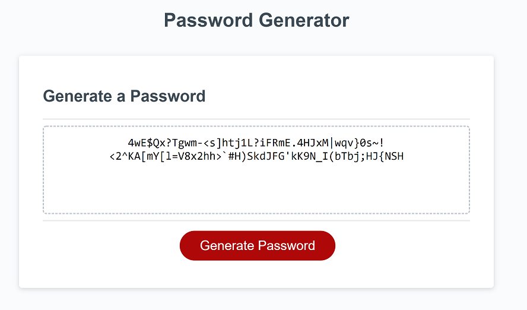

# the-password-generator

## Description

This project shows the creation of a random password generator mainly through the use of javascript.

## Features

This generator has the abillity to generate a random password with the option of including or excluding
upper and lowercase letters as well as special characters and numbers. 

For each type of character to include there are prompts that allow the user to select which options they 
would like to include.

## Links

<a href="https://vilas-izquierdo.github.io/the-password-generator/>Deployed Page</a>

<a href="https://github.com/vilas-izquierdo/the-password-generator">GitHub</a>k